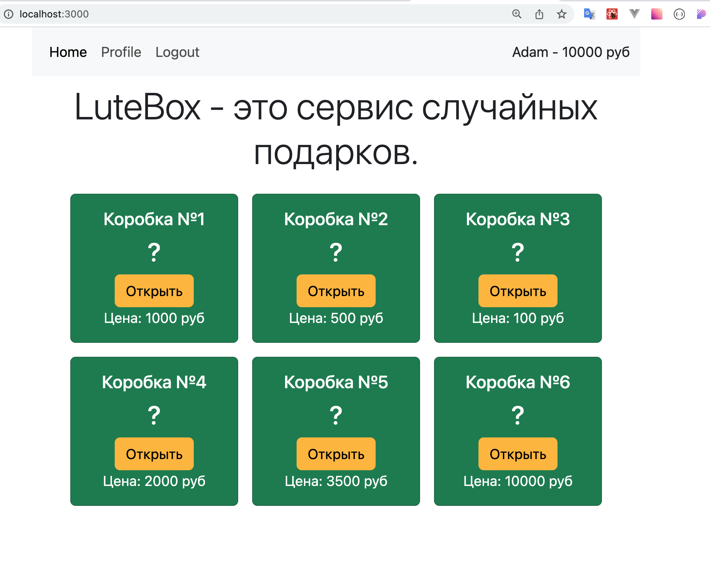
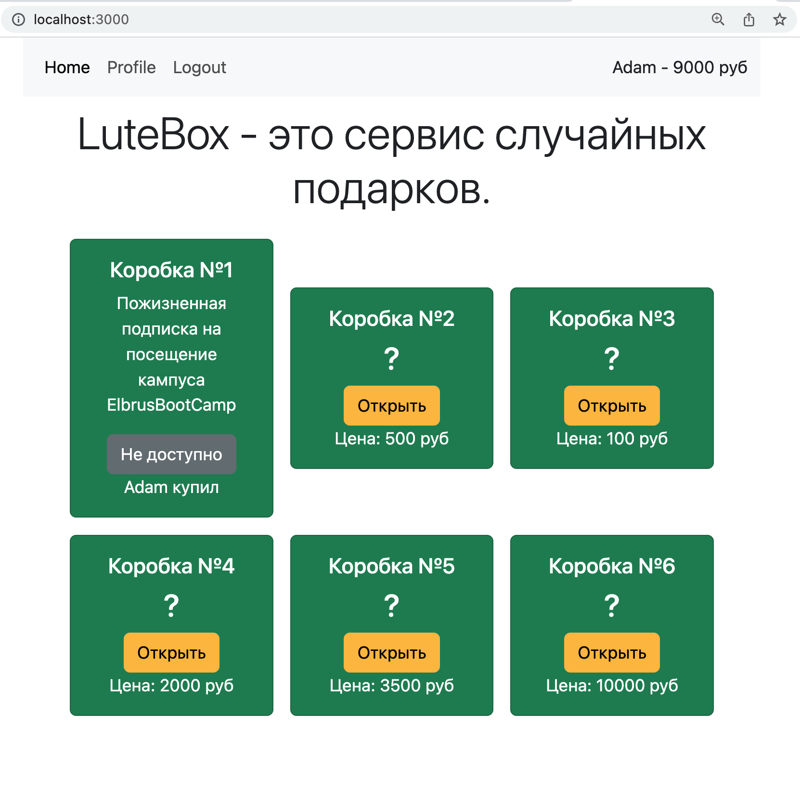

# LootBox - Сервис случайных подарков

Твоя задача — создать приложение, которое увлечет пользователей и заставит их возвращаться
снова и снова! "LootBox" — это не онлайн-казино, а сервис, где каждый может испытать
удачу, открывая ящики с сюрпризами. В приложении пользователи смогут авторизоваться,
пополнять баланс, тратить его на лутбоксы, делиться впечатлениями и радоваться за других.

### Рекомендации

1. Прочти задание целиком перед началом работы.
2. Сфокусируйся на функциональности — это будет основным критерием оценки.
3. Включи навигацию по сайту, чтобы пользователь мог перейти на любую страницу через
   ссылки, кнопки и другие элементы интерфейса.
4. Если какой-то релиз выполнить сложно, переходи к следующему.
5. Обрабатывай ошибки в коде, избегай падения приложения при некорректных данных.
6. Спроектируй базу данных и структуру проекта, используя рекомендации ниже. Подготовь
   сиды.

## Release 0

Создай две основные таблицы: для пользователей и для сюрпризов.

- Пользователи: должны иметь данные для аутентификации и поле для баланса.
- Сюрпризы: содержат поля name, price, description, и (по желанию) image. Изначально
  сюрпризы не привязаны к пользователям.

Пропиши миграции для этих таблиц и создай seed-файлы для наполнения базы данных.

Добавь навигационную панель с отображением текущего баланса для авторизованных
пользователей. Настрой доступ к страницам в зависимости от состояния аутентификации и роли
пользователя.

## Release 1

Реализуй аутентификацию, регистрацию и выход из аккаунта. При регистрации пользователю
автоматически начисляется начальный баланс в 10,000 рублей.

## Release 2

Выведи на главной странице список всех доступных лутбоксов.

- _Публичная информация:_ название и стоимость лутбокса видны всем пользователям.
- _Приватная информация:_ описание видно только пользователю, который открыл лутбокс.

**Замечание:** форма для добавления сюрпризов не нужна, лутбоксы добавляются seed-скриптом
с минимум 10 записями.

# Release 3

Реализуй функцию открытия лутбокса:

1. Привязывай открытый лутбокс к пользователю и делай его видимым только для него.
2. Списывай с баланса пользователя стоимость лутбокса.
3. Закрепляй лутбокс за пользователем, чтобы другие не могли его открыть.
4. Описание открытого лутбокса видно только открывшему владельцу, для остальных оно
   скрыто.

## Release 4

Создай страницу личного кабинета с возможностью пополнения баланса и списком открытых
лутбоксов.

- _Форма пополнения баланса:_ позволяет пользователю внести дополнительную сумму.
- _Список открытых лутбоксов:_ отображает все лутбоксы, которые пользователь открыл, с
  возможностью удаления. При удалении лутбокс пропадает из базы данных.

## Release 5

Добавь элементы UI и стили. При открытии лутбокса показывай модальное окно с поздравлением
и описанием сюрприза.

Не забудь, что один и тот же подарок не могут открыть два пользователя -- подготовь для
этого проверку на стороне сервера, а также пропиши необходимые мидлвары.

Проверь также правильность пополнения и изменения баланса: после перезагрузки страницы
должна показываться актуальная, а не устаревшая сумма.

P.S. Если показывается старая сумма, то куки содержит старый `refresh` токен. Перевыпусти
новый токен с актуальными данными из БД и помести его в куки.

## Release 6

Добавь возможность пользователям делиться своими выигрышами. Например, владелец лутбокса
может отметить его открытым, чтобы остальные тоже увидели его содержимое.

А также создай административный интерфейс для управления лутбоксами. Пусть только
администратор может добавлять и удалять лутбоксы, а также управлять балансом
пользователей.
